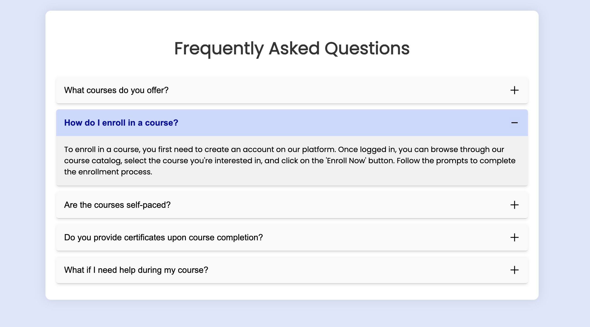
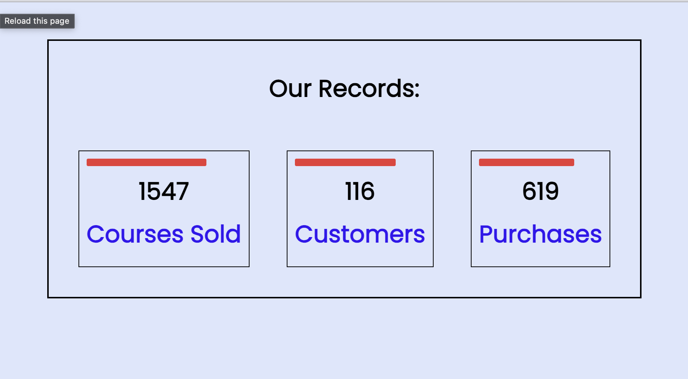

# BASIC_JS_Projects

Welcome to my JavaScript Practice Projects repository! 

## Learnings

This repo contains a collection of basic JavaScript projects that I have worked on. Each project has been an exciting journey and a valuable learning experience, helping me to enhance my understanding of JavaScript concepts and improve my logic-building skills.

## Projects

### 1. Background_Color_Flipper

 
Description: This project changes the background color of the webpage using a valid hex code inputted by the user.

### 2. BMI_Calculator

Description: This project calculates the Body Mass Index (BMI) based on user inputs of height and weight, and also displays whether they are underweight, overweight, or healthy on the basis of their BMI value.

### 3. Arithmetic Calculator

Description: 
I learned how to implement a basic calculator using object-oriented programming principles, including defining a class with methods for different operations (clear, delete, append number, choose operation, compute, and update display). I referred to Web Dev Simplified's video for this project; his approach to writing the code was incredibly insightful and easy to follow.

### 4. Countdown

Description: This project features a countdown timer that counts down to a defined date and time. I found this functionality extremely ideal to add in websites.

### 5. Counter

Description: This project allows users to increment, decrement, or reset a counter displayed on the webpage.

### 6. Random_Pwsd_Generator

Description: This project generates a random password of length=12 from a given set of characters.

### 7. Theme_Changer

Description: This project allows users to switch between different themes for the webpage, such as light and dark modes. It is just like a simple toggle button.

### 8. Bg_image_slider

Description: In this project I tried creating a carousel or slider using 3 images in js.

### 9. FAQs

### 10. Numbers (simple progress bar)

### 11. Video_Bg

Feel free to explore the projects and their code. If you have any questions or suggestions, please don't hesitate to reach out!

---

**Author:** Nupur Mehlawat
